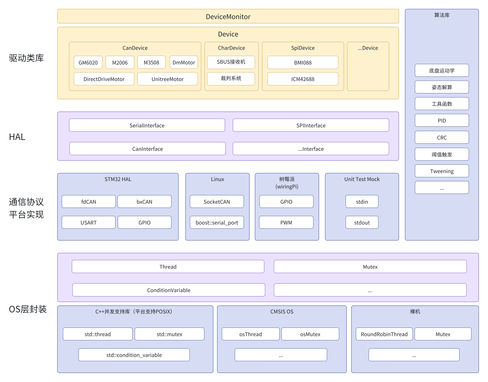

# 简介

librm 是我们（西安电子科技大学 IRobot 战队）在 2024 赛季启动开发的一套面向 Robomaster 比赛的跨平台嵌入式软件开发框架。开发语言为 C++17，视平台而定可以不依赖 POSIX，使得用户可以在 Linux 和 STM32 两套硬件上使用同一套 API 来开发机器人。

它的诞生是为了终结往年赛季“一辆车一套 bsp，每个人实现各不相同，一处 bug 五辆车修五次”的混乱场面。所有机器人使用同一套底层代码，便于统一管理。简洁、统一的用户接口还另外带来了提高应用层开发效率的正面作用。

我们认为 librm 在嵌入式/机器人开发方面具有更广泛的价值，不应该被局限在我们队内的电控组里，所以把它以 MIT 协议开源在 [Github](https://github.com/XDU-IRobot/librm) 上。待其完善并经过足够实战使用验证可靠性后，会开源到论坛上。

## 软件架构

